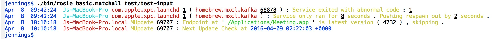
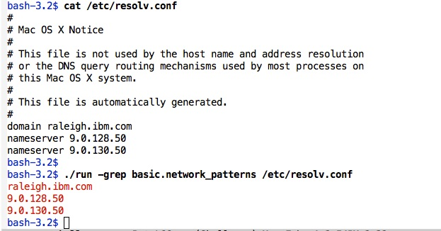

[](https://travis-ci.org/jamiejennings/rosie-pattern-language)

# Rosie Pattern Language

Rosie is an alternative to modern Regular Expressions (regex) that is designed
to scale to big data, many developers, and large collections of patterns.  Rosie
Pattern Language:

* Looks like a programming language, and plays well with development tools
* Comes with a library of dozens of useful patterns (timestamps, network addresses, and more)
* Has development tools: tracing, REPL, color-coded match output
* Produces JSON output (and other formats)


## Contents

- [Features](#features)
- [Building](#building)
- [Using Rosie's CLI](#using-cli)
- [Using Rosie's REPL](#using-repl)
- [Using Rosie in your programs](#using-api)

- [API documentation](#api-documentation)
- [Geek notes](doc/geek.md) for the PL and CS geeks among us

- [Project Roadmap](#project-roadmap)
- [Development and contributing](#development-and-contributing)
- [Acknowledgements](#acknowledgements)

## Features

- Small: the Rosie compiler/runtime/libraries take up less than 600KB of disk
- Good performance: **what to say, specifically?**
- Extensible pattern library
- Packages of patterns are easy to share
- Rosie is fluent in UTF-8, ASCII, and the binary language of moisture
'vaporators (arbitrary byte-encoded data)

## Building

Platforms: OS X, Linux, and probably that Ubuntu-on-Windows thing

1. `make`
2. `make install`  (optional)

## Using the CLI

- Examples
- Link to man page

## Using the REPL

- Examples
- Link to full reference?

## Using Rosie in your own programs

- Language coverage
- Building librosie
- Link to full api documentation

## API

- Describe librosie
- Link to full api doc

## Project roadmap

- [x] Change to semantic versioning
- [x] v1.0.0-alpha-1 release
- [ ] Unicode character classes
- [ ] Brew installer for OS X
- [ ] RPM and debian packages
- [ ] API (C)
- [ ] Python module
- [ ] C, Go modules
- [ ] Ruby, node.js modules
- [ ] Support JSON output for trace, config, list, and other commands
- [ ] Customize color assignments
- [ ] Customize initial environment
- [ ] Generate patterns automatically from locale data
- [ ] Toolkit for user-developed macros
- [ ] Toolkit for user-developed output encoders
- [ ] Compiler optimizations
- [ ] Additions to standard library


<hr>


## A quick look at Rosie

For a quick test of Rosie's capabilities, use the Rosie Pattern Engine to look
for a basic set of patterns in any text file on your system.  Good candidates
may be `/etc/resolv.conf` or `/var/log/system.log`.  Use the pattern
`basic.matchall` for this.  In the example below, we use a few lines from the
Mac OSX system log (from the Rosie test suite):



Rosie is parsing the log file into fields that are printed in various colors.
To see which colors correspond to which RPL patterns, type `./bin/rosie -patterns` to
see all defined and loaded patterns and the color (if any) that is assigned to
them for output at the terminal.

To see the JSON version of the Rosie output, use the `-encode` option to specify
`json`.  In the example below, the pattern being matched is `common.word
basic.network_patterns`.  Rosie finds a line matching this pattern, and the
pattern matches at position 1 of the input line.  The sub-match `common.word`
also begins at position 1, and the sub-match `basic.network_patterns` begins at
position 12:

```
jamiejennings$ rosie -encode json 'common.word basic.network_patterns' /etc/resolv.conf | rjsonpp
{"*": 
   {"pos": 1.0, 
    "text": "nameserver 10.0.1.1", 
    "subs": 
      [{"common.word": 
         {"text": "nameserver", 
          "pos": 1.0}}, 
       {"basic.network_patterns": 
         {"pos": 12.0, 
          "text": "10.0.1.1", 
          "subs": 
            [{"network.ip_address": 
               {"text": "10.0.1.1", 
                "pos": 12.0}}]}}]}}
jamiejennings$ 
``` 

(Note: `rjsonpp` is my own json pretty-printer, similar to `json_pp`.)

## How to build: clone the repo, and type 'make'

After cloning the repository, there is just one step: `make`.  The `makefile` will download the
needed prerequisites, compile them, and run a quick test.

You should see this message if all went well: `Rosie Pattern Engine installed successfully!`

The rosie executable is in `./bin/rosie`.  More installation information is available:

* [Installation details and tips](doc/install.md)
* [RHEL 7 install tips](doc/rhel.md)
* [Ubuntu 16 install tips](doc/ubuntu.md)
* [Windows 10 Anniversary Edition install tips](doc/windows10ae.md)
* [Sample docker files](docker/) *Note: These may need updating*

## Project status

The current release is v0.99k.  The RPL language syntax and semantics have been
stable for a while now.  In our current work, which is leading up to release
v1.0, we are doing some refactoring and also adding new features.  Our goal is
to release v1.0 in the summer of 2017 in a strictly forward-looking way.  That
is, we want future versions 1.x to be backwards compatible to v1.0.

At the [Rosie Pattern Language blog](http://tiny.cc/rosie), you can find a
preview of what is coming in v1.0.


## Docs

The new [Rosie Pattern Language blog](http://tiny.cc/rosie) has a preview of the
forthcoming version 1.0, and will grow to contain documentation and examples.

Current release documentation:
* [Command Line Interface documentation](doc/cli.md)
* [Rosie Pattern Language Reference](doc/rpl.md)
* [Interactive read-eval-print loop (repl)](doc/repl.md)

Rosie on IBM developerWorks Open:
* [Rosie blogs and talks](https://developer.ibm.com/open/category/rosie-pattern-language/)
* Including:
    * [Project Overview](https://developer.ibm.com/open/rosie-pattern-language/)
    * [Introduction](https://developer.ibm.com/open/2016/02/20/world-data-science-needs-rosie-pattern-language/)
    * [Parsing Spark logs](https://developer.ibm.com/open/2016/04/26/develop-test-rosie-pattern-language-patterns-part-1-parsing-log-files/)
    * [Parsing CSV files](https://developer.ibm.com/open/2016/10/14/develop-test-rosie-pattern-language-patterns-part-2-csv-data/)

For an introduction to Rosie and explanations of the key concepts, see
[Rosie's _raison d'etre_](doc/raisondetre.md).

Rosie's internal components, as well as the utilities needed to build Rosie are
listed [here](doc/arch.md).

Rosie author on Twitter: [@jamietheriveter](https://twitter.com/jamietheriveter)

## Useful tips

### Sample patterns are in the rpl directory

The file `MANIFEST` lists the Rosie Pattern Language files that Rosie compiles
on startup.  These files are typically in the `rpl` directory, but could be
anywhere.  Browse the `rpl` directory to see how patterns are written.

### Write patterns on the command line

You can write patterns on the command line, e.g.:  (output will be in color,
which is not shown here)

```
jamiejennings$ rosie 'network.ip_address common.word' /etc/hosts
127.0.0.1 localhost 
255.255.255.255 broadcasthost 
```

And the same command but with JSON output:

``` 
bash-3.2$ rosie -encode json 'network.ip_address common.word' /etc/hosts 
{"*":{"1":{"network.ip_address":{"text":"127.0.0.1","pos":1}},"2":{"common.word":{"text":"localhost","pos":11}},"text":"127.0.0.1\tlocalhost","pos":1}}
{"*":{"1":{"network.ip_address":{"text":"255.255.255.255","pos":1}},"2":{"common.word":{"text":"broadcasthost","pos":17}},"text":"255.255.255.255\tbroadcasthost","pos":1}}
``` 

### The "-grep" option looks for your pattern anywhere in the input

By default, Rosie matches your pattern against an entire line.  But what if you
want grep-like functionality, where a pattern may be found anywhere in the
input?  Try a command like this:

``` 
rosie -grep basic.network_patterns /etc/resolv.conf
```

For example:



Note that the pattern `basic.network_patterns` contains patterns that match path
names as well as email addresses, domain names, and ip addresses. 

### Pattern debugging on the command line

Interactive pattern debugging can be done using the read-eval-print loop (see
[interactive pattern development](doc/repl.md)).  But debugging output can also
be generated at the command line.

The `-debug` command line option generates verbose output about every step of
matching.  It is best to use this option with only **one line of input** because
so much output is generated.

### Adding new patterns for Rosie to load on start-up

When Rosie starts, all the Rosie Pattern Language (rpl) files listed in
`MANIFEST ` are loaded.  You can write your own patterns and add your
pattern file to the end of the manifest, so that Rosie will load them.
(Currently, this is the only way to add new patterns.)


## How you can help

### Calling Rosie from Go, Python, node.js, Ruby, Java, or ...?

Rosie is available as a [C library](ffi) that is callable from these
languages.  There are [sample programs](ffi/samples) that demonstrate it, and
these could be improved by turning them into proper libraries, one for each
target language.

If you're a Python hacker, we could use your help turning our
sample `librosie` client into a Python module.  Same for the other languages.

And since `librosie` is built on `libffi`, it's pretty easy to access Rosie from
other languages.  This is another great area to make a contribution to the
project.

### Write new patterns!

We are happy to add more patterns to the initial library we've started in the
[rpl directory](rpl), whether they build on what we have or are entirely new.

